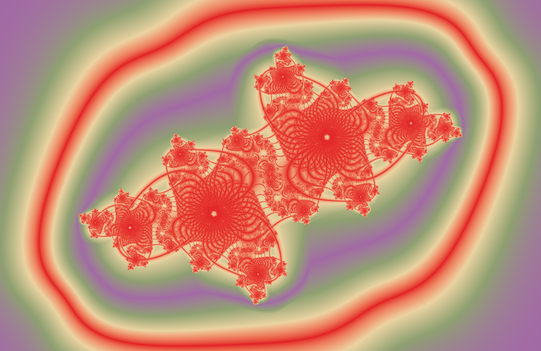
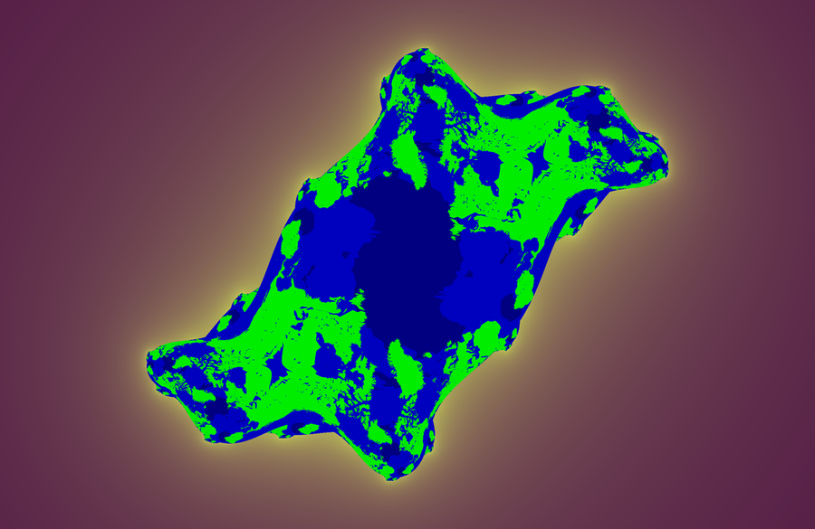
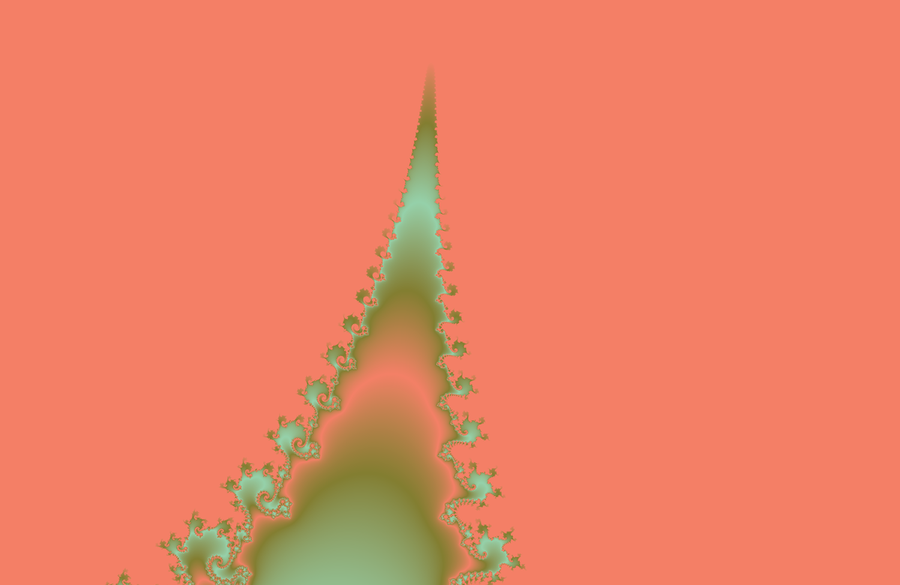

# Fractal Studio

Un studio interactif pour composer et animer des fractales de Julia et de Mandelbrot :
on assemble des **modules** (chemin de `c`, orbit traps, biomorphe, palette, zoom, rotation),
on dessine les **courbes de vélocité** comme dans un séquenceur audio, et on exporte en MP4.



## Galerie

| | |
|:--:|:--:|
|  |  |
| **Biomorphe de Pickover** — le OU composante crée les cils | **Trap SVG vectoriel** — un `.svg` piégé dans l'orbite, contours exacts |
|  |  |
| **Zoom ×14** dans la vallée des hippocampes | **Chromavision** — palettes Sanzo Wada en OKLab |

## Fonctionnalités

**Studio modulaire** — clic droit dans la zone du bas pour ajouter un module ; sa
*présence* l'active, la croix le retire, et on les réordonne par glisser-déposer.

- **`c (Mandelbrot)`** — on dessine le chemin de `c` sur la carte de Mandelbrot ; la
  fractale se déforme le long de ce chemin.
- **Orbit traps** (8 formes, exclusives entre elles) : point, cercle, **anneau 3D**
  (projection orthographique d'un cercle incliné → ellipse exacte), droite, croix, sinus,
  **image** (PNG détouré) et **géométrique** (série de copies en spirale).
- **Traps SVG vectoriels** — un `.svg` est piégé par test *point-dans-forme* exact
  (nombre d'enroulement) : les contours restent nets à n'importe quelle échelle, sans
  pixellisation de texture.
- **Biomorphe de Pickover** — voir [la section dédiée](#mode-biomorphe-pickover).
- **Couleur** — les 348 palettes **Sanzo Wada** (avec permutations) ou un dégradé de
  couleurs choisies à la roue / pipette.
- **Zoom** (interpolation logarithmique) et **rotation** de la vue.

**Animation**

- **Éditeur de vélocités** (bouton `∿ VÉLOCITÉS`) — une *lane* par paramètre animé, façon
  automation Logic Pro : points, courbures, plateaux (= pauses), préréglages.
- **Vitesse uniforme** — reparamétrage du chemin de `c` par l'estimateur de distance (DEM)
  à la frontière de M, pour que chaque frame apporte autant de changement visuel.
  Métrique alternative : différence perceptuelle OKLab entre frames.
- **Export MP4** (540p → 1920p) avec anti-crénelage 2×.

**Moteur**

- Noyaux **Numba** parallèles ; **formules Julia libres** (`sin(z)+c`, `z^3+0.4*conj(z)+c`…)
  compilées à la volée en kernels Numba, avec repli NumPy.
- Bouton **🎲** : génère une formule aléatoire valide.
- Bascule **Julia ↔ Mandelbrot** globale.
- Coloration **OKLab** perceptuelle, égalisation par percentiles, effet miroir.

## Installation

```bash
git clone <url-du-dépôt> && cd Mandelbrot_project
python3 -m venv myenv
myenv/bin/pip install -r requirements.txt
```

## Utilisation

```bash
myenv/bin/python fractal_studio.py     # le studio interactif
myenv/bin/python daily_wallpaper.py    # génère le fond d'écran du jour
```

Pour un nouveau fond d'écran chaque matin (macOS), éditer les chemins de
`com.fractal.wallpaper.plist` puis :

```bash
cp com.fractal.wallpaper.plist ~/Library/LaunchAgents/
launchctl load ~/Library/LaunchAgents/com.fractal.wallpaper.plist
```

## Structure

| Fichier | Rôle |
|---|---|
| `fractal_studio.py` | L'application : interface, modules, vélocités, export. |
| `daily_wallpaper.py` | Génère le fond d'écran quotidien et l'applique. |
| `iteration.py` | Noyaux Numba d'itération : escape time, Mandelbrot, biomorphe, période, attracteur. |
| `orbit_trap.py` | Noyaux des orbit traps (distances aux formes, traps image et géométrique). |
| `svg_trap.py` | Traps SVG **vectoriels** : parsing, aplatissement, test point-dans-forme. |
| `path_reparam.py` | Reparamétrage « vitesse uniforme » : DEM, coût perceptuel, longueur d'arc. |
| `render.py` | Palettes Sanzo Wada, OKLab/HSV/RGB, égalisation, miroir, downscale. |
| `fractal.py` | Générateur de champs (grille, transformations) pour `daily_wallpaper`. |
| `transform.py` | Transformations du plan complexe. |
| `legacy/` | Étapes antérieures et outils ponctuels — voir [legacy/README.md](legacy/README.md). |
| `tests/` | `pytest` |

```bash
myenv/bin/python -m pytest tests/ -q
```

## Mode biomorphe (Pickover)

Les formes organiques de Clifford Pickover (allures d'invertébrés, cils, appendices).
On itère z ← f(z, c) puis on classe le **z final** par un test composante : un pixel est
*membre* si `|Re(z)| < L` **OU** `|Im(z)| < L`. C'est ce OU (et non un test de module) qui
crée les appendices. La structure est colorisée en continu via la palette OKLab
(valeur = `log(1 + min(|Re z|, |Im z|))`), ou au choix par l'escape time.

Le biomorphe est un **module** (clic droit → « + biomorphe » ; présence = actif). Il n'a
pas de fonction propre : il applique la classification à la **formule Julia active** (champ
*Julia form*, et donc au **🎲**). Le `c` vient du module « c (Mandelbrot) » quand il est
présent — le biomorphe suit alors le chemin animé et **morphe** pendant la lecture — sinon
du `c` statique. La bascule Julia/Mandelbrot s'applique (en Mandelbrot, `c` = pixel). Le
module est exclusif avec les orbit traps (source de champ alternative) mais compose avec
`c`, palette, rotation et zoom.

| Contrôle | Rôle | Défaut |
|---|---|---|
| `L (OU)` | seuil du test OU (taille des cils/appendices) | 10 |
| `modulus` | bailout de module (fin d'itération si \|z\| > modulus) | 100 |
| `max_iter` | itérations maximales | 50 |
| `couleur` | `structure` (min des composantes) ↔ `escape time` | structure |

Le chemin polynomial (`z²+c`) coûte autant que l'escape time classique ; les fonctions
transcendantes (`sin`, `z^z`) sont plus lentes (intrinsèque).

**Exemples** (formule dans *Julia form*, le reste dans le module)

- *Biomorphe classique* — `z^3 + c`, `c=0.5+0i`, `L=10`, `modulus=100`, `max_iter=50`. Corps radial à cils.
- *Floral* — `sin(z) + c`, `c=0.35+0.1i`, `L=12`, `max_iter=40`.
- *Chou-fleur* — `z^z + sin(z) + c`, `c=0+0i`, `L=8`, `max_iter=30`.
- *Hybride* — `z^3 + 0.4*sin(z) + c`, `c=0.4+0.1i`, `L=10`.

## Aux origines

Le projet est né d'une envie : afficher la fractale de Mandelbrot comme une **mosaïque
d'ensembles de Julia** — chaque tuile est le Julia du `c` correspondant à sa position.


Puis il a dérivé vers un fond d'écran quotidien, et enfin vers ce studio. C'est un projet
d'apprentissage, amené à évoluer encore.

## Crédits

- **Palettes** : les combinaisons de [Sanzo Wada](https://sanzo-wada.dmbk.io/) (*A Dictionary
  of Color Combinations*).
- **Biomorphes** : Clifford A. Pickover, *Computers, Pattern, Chaos and Beauty*.
- **Distance à l'ellipse** (trap anneau 3D) : approximation analytique d'
  [Inigo Quilez](https://iquilezles.org/articles/distfunctions2d/).
- **OKLab** : espace colorimétrique de Björn Ottosson.
