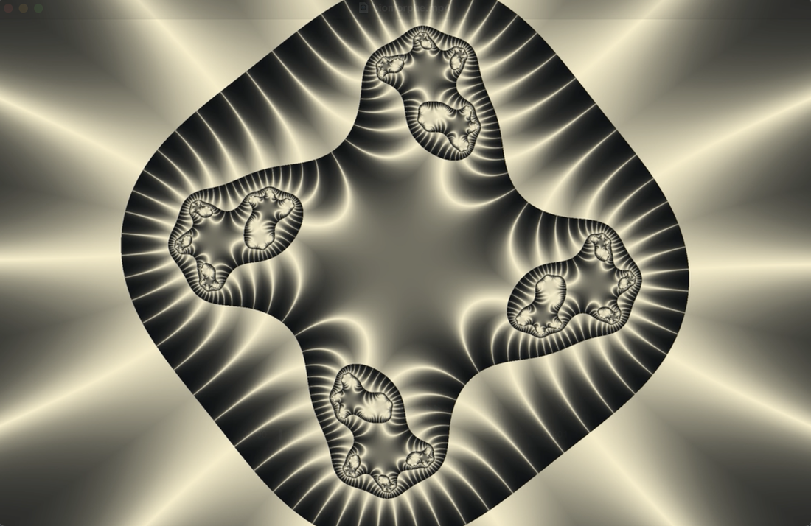
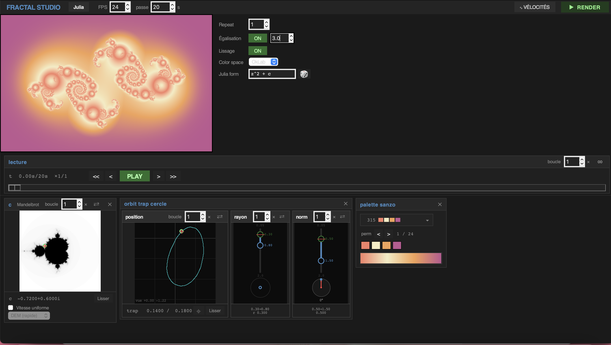

# Fractal Studio

Un studio interactif pour composer et **animer** des fractales de Julia et de Mandelbrot :
on assemble des modules, on dessine les courbes de vélocité comme dans un séquenceur audio,
on exporte en MP4.


## Galerie

| | |
|:--:|:--:|
|  |  |
| Orbit trap **point** | Orbit trap **cercle** |
|  |  |
| **Biomorphe** de Pickover | **L'interface** — modules, vélocités, export |

## Fonctionnalités

**Modules** — clic droit dans la zone du bas pour en ajouter ; leur présence les active,
la croix les retire, le glisser-déposer les réordonne.

- **`c (Mandelbrot)`** — on dessine le chemin de `c` ; la fractale se déforme le long.
- **Orbit traps** — point, cercle, anneau 3D, droite, croix, sinus, image (PNG) et
  géométrique. Les **SVG sont vectoriels** : test point-dans-forme exact, contours nets à
  toute échelle.
- **Biomorphe** (Pickover) — classification du `z` final par `|Re| < L` **OU** `|Im| < L`
  (c'est le OU, pas un test de module, qui crée les cils). S'applique à la formule active.
- **Couleur** — 348 palettes **Sanzo Wada** (+ permutations) ou dégradé libre (roue, pipette).
- **Zoom** (logarithmique) et **rotation**.

**Animation**

- **Éditeur de vélocités** — une *lane* par paramètre, façon automation Logic Pro : points,
  courbures, plateaux (= pauses).
- **Vitesse uniforme** — reparamétrage du chemin par l'estimateur de distance (DEM) à ∂M,
  pour que chaque frame apporte autant de changement visuel.
- **Export MP4** 540p → 1920p, anti-crénelage 2×.

**Moteur** — noyaux **Numba** parallèles ; **formules Julia libres** (`sin(z)+c`,
`z^3+0.4*conj(z)+c`…) compilées à la volée, repli NumPy ; bouton **🎲** pour une formule
aléatoire ; bascule **Julia ↔ Mandelbrot** ; coloration **OKLab**.

## Installation et utilisation

```bash
python3 -m venv myenv
myenv/bin/pip install -r requirements.txt

myenv/bin/python fractal_studio.py     # le studio
myenv/bin/python daily_wallpaper.py    # le fond d'écran du jour
myenv/bin/python -m pytest tests/ -q   # les tests
```

Pour un fond d'écran chaque matin (macOS) : éditer les chemins de
`com.fractal.wallpaper.plist`, le copier dans `~/Library/LaunchAgents/`, puis
`launchctl load ~/Library/LaunchAgents/com.fractal.wallpaper.plist`.

## Structure

| | |
|---|---|
| `fractal_studio.py` | L'application : interface, modules, vélocités, export. |
| `daily_wallpaper.py` | Le fond d'écran quotidien. |
| `iteration.py` · `orbit_trap.py` | Noyaux Numba : escape time, Mandelbrot, biomorphe, traps. |
| `svg_trap.py` | Traps SVG vectoriels (parsing, point-dans-forme). |
| `path_reparam.py` | Reparamétrage « vitesse uniforme » (DEM, coût perceptuel). |
| `render.py` | Palettes, OKLab, égalisation, miroir. |
| `fractal.py` · `transform.py` | Génération de champs et transformations du plan. |
| `legacy/` | Étapes antérieures — voir [legacy/README.md](legacy/README.md). |

## Aux origines

Le projet est né d'une envie : afficher Mandelbrot comme une **mosaïque de Julia** — chaque
tuile est le Julia du `c` de sa position. Puis il a dérivé vers un fond d'écran quotidien,
et enfin vers ce studio. Projet d'apprentissage, amené à évoluer.


## Crédits

[Sanzo Wada](https://sanzo-wada.dmbk.io/) (*A Dictionary of Color Combinations*) ·
Clifford A. Pickover (*Computers, Pattern, Chaos and Beauty*) ·
[Inigo Quilez](https://iquilezles.org/articles/distfunctions2d/) (distance à l'ellipse) ·
Björn Ottosson (OKLab).
